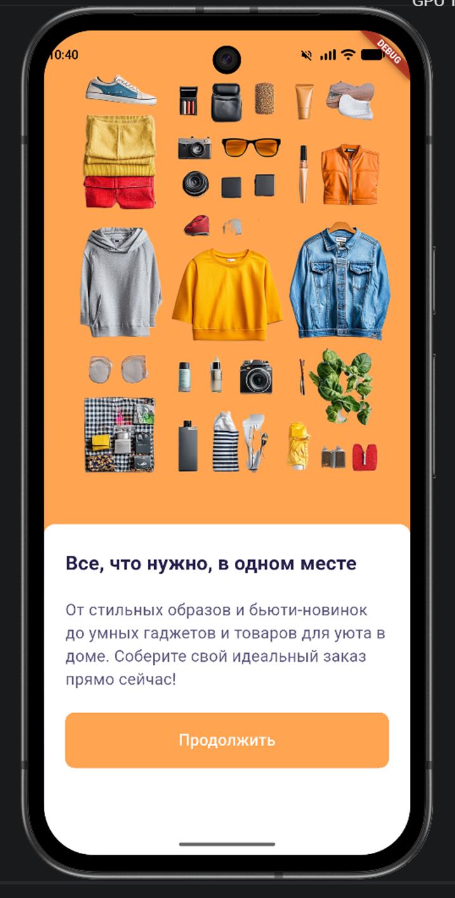
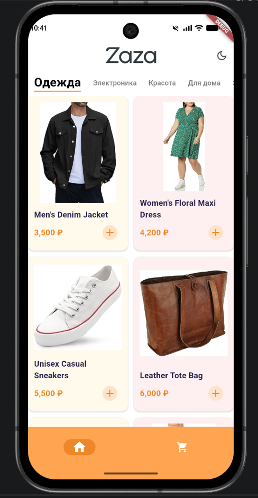
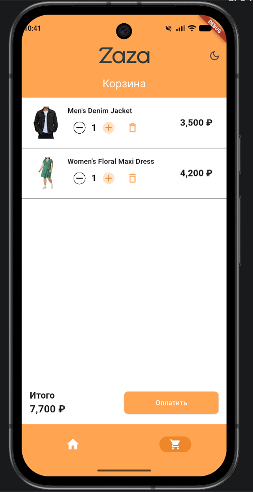
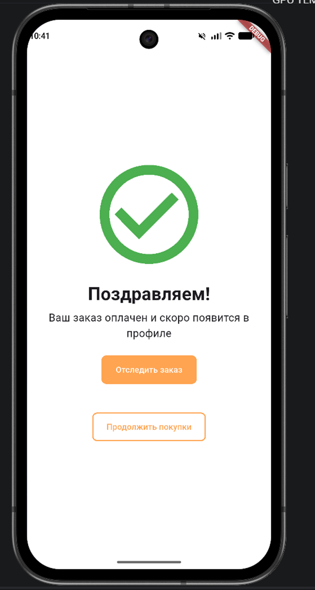

<div align="center">

<h1>Zaza</h1>

<p>
  
  
  
  
</p>

<p><b>Каталог мультикатегорийного маркетплейса на Flutter.</b></p>

</div>

## О проекте

**Zaza** - учебное мобильное приложение маркетплейса с каталогом товаров разных категорий.

## Инструкция к запуску

```
git clone https://github.com/oxExplorex/zaza_shop_app.git
cd zaza_shop_app
flutter pub get
flutter run
```

## Реализовано

- Приветственный экран
- Загрузка товаров через api
- Каталог товаров с фильтрацией по категориям
- Просмотр карточки товара
- Добавление товара в корзину
- Изменение количества товаров
- Оформление товаров

## Требует небольшой доработки

- Светлая\темная тема
- Адаптация под все экраны

## В разработке

- Рекомендации
- История просмотренных карточек








